# Databricks e seus Fundamentos

Nesse repositorio eu exploro os conhecimentos em Databricks e preparo algumas perguntas que englobam seus fundamentos no final.

## Tópicos

### 1° Historia das plataformas de manejamento de dados.

### 2° O que é a Plataforma Databricks Intelligence?

### 3° Arquitetura da Plataforma Databricks DI e Fundamentais de Segurança.

- *a.* Visão geral da arquitetura da plataforma.
- *b.* Data governance.
- *c.* Segurança, Confiabilidade e Performance.
- *d.* The Data Intelligence Engine

### 4° Workloads suportadas na Plataforma Databricks DI

- *a.* Data warehousing
- *b.* Orchestration
- *c.* ETL & analise tempo-real
- *d.* Data science & AI

### 5° Sumário e Proximos passos.

---

## The History of Data Management Platforms

<!-- IMPORTANTE: Esta seção responde às perguntas "Descreva a origem e propósito das plataformas de data management" e "Descreva como plataformas de gestão de dados evoluíram para ser plataformas de dados inteligentes" -->

### No fim dos anos 80 (1980), empresas queriam possuir as percepções movidas por dados (*data-driven insights*) para decisões empresariais e inovação.

Para isso, organizações precisavam sair dos dados coletados apenas por simples bases relacionais para sistemas que manejavam e analisavam dados sendo gerados em tempo real e em grandes volumes com alta velocidade.

  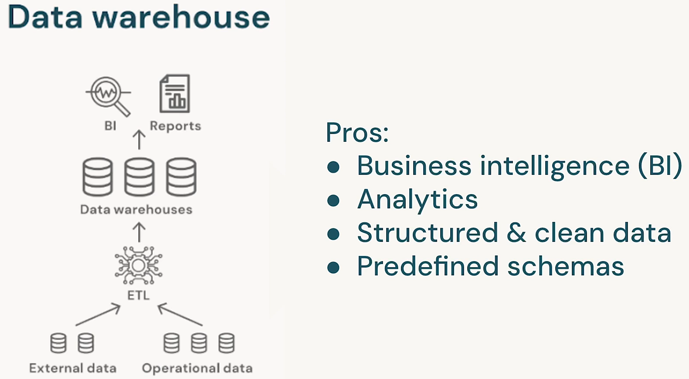

**Data Warehouses** foram criados para coletar e consolidar o fluxo de dados e prover suporte geral para dados de inteligência e análise de empresas.

Dados e Data Warehouses eram estruturados e limpos, com esquemas pré-definidos. Porém, Data Warehouses não foram feitos com dados semiestruturados ou não estruturados em mente — dessa forma, não havia suporte para dados fora do padrão correto.

Isso causou:

- Inflexibilidade em esquemas
- Problemas com pico de volume e velocidade
- Longo tempo de processamento

Com o avanço do mundo digital, isso apenas piorou, pois os dados aumentaram em volume, velocidade e variedade. O que desfavoreceu as Data Warehouses: tomava muito tempo para processar dados e prover resultados, e havia capacidade limitada para lidar com variedade e velocidade de dados.

---

### Em 2000 houve a ascensão de algo chamado **"Big Data"**, ocasionando a criação dos **Data Lakes**.

<!-- IMPORTANTE: Esta seção responde à pergunta "Explique os desafios de gerenciar e usar Big Data" -->

O Data Lake permitia que dados estruturados, semiestruturados e não estruturados convivessem no mesmo ambiente simultaneamente — coletados em volume e velocidade necessários para dar suporte ao ritmo de geração de dados da época.

  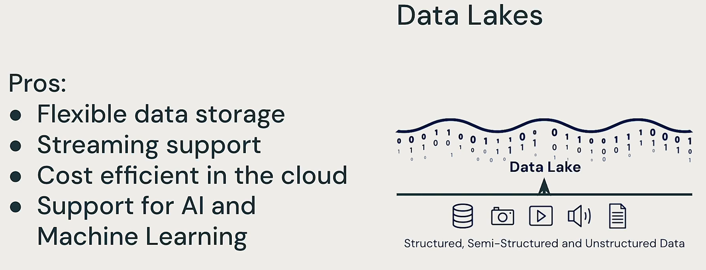

Diversos dados diferentes poderiam ser guardados lado a lado em um Data Lake. Dados criados de diferentes origens — sejam logs de web ou dados de sensores — poderiam ser transmitidos para o Data Lake com facilidade, velocidade e de maneira barata em armazenamento de objetos cloud de baixo preço.

Apesar dos Data Lakes resolverem o problema de armazenamento, eles criaram novos problemas — não possuíam coisas essenciais que Data Warehouses tinham:

- **Sem suporte para dados transacionais** e sem capacidade de reforçar qualidade de dados — baixa confiança nos dados
- **Velocidade de análise lenta** pela alta quantidade de dados — a oportunidade de decisões com impacto nunca se manifestou
- **Governança de dados desafiadora** para reforço de segurança e privacidade, pela falta de estrutura

---

### Em 2021 ocorreu a ascensão do paradigma da arquitetura **LakeHouse**.

Em 2013, a Databricks foi fundada. Em 2020, introduziu ao mundo a primeira e única Plataforma Lakehouse em Cloud, combinando os melhores aspectos de Data Warehouses e Data Lakes em uma plataforma unificada e aberta para dados e IA.

Em 2021, os fundadores da Databricks e outros indivíduos cunharam o termo **"Arquitetura Lakehouse"** no artigo:

> *"Lakehouse: A nova geração de plataformas abertas que unificam Data Warehousing e Análise Avançada"*

  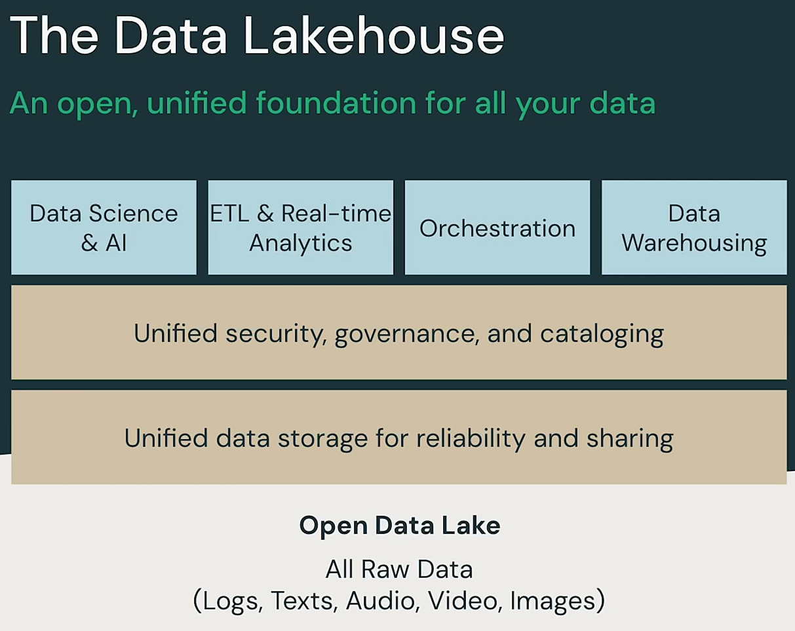

Times de empresas ficavam desincronizados — usar tecnologias separadas de Data Warehouses e Data Lakes causava problemas de velocidade de entrega.

Para resolver esse problema, a Databricks identificou a necessidade de algo **unificado e simples**, criando o Data Lakehouse: combinando os benefícios de um Data Lake com o poder de análise e controle de um Data Warehouse. Isso criou uma fonte confiável de dados, combinando acesso direto a IA e BI trabalhando juntos, com governança de segurança unificada.

  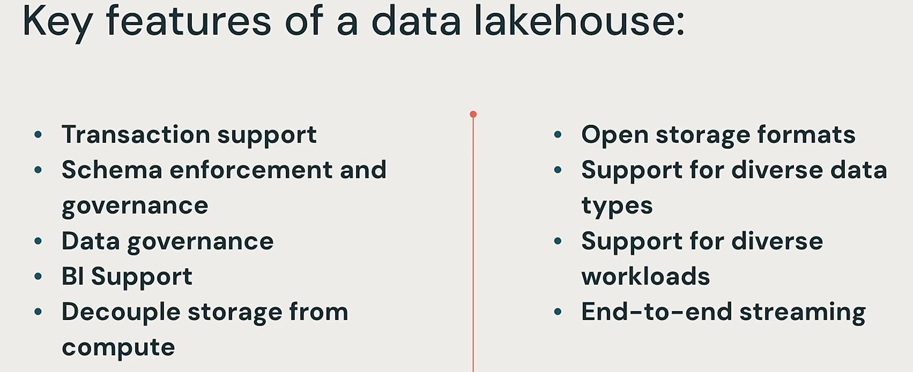

Agora, empresas podiam guardar, refinar, analisar e acessar dados semiestruturados, estruturados ou não estruturados em um único lugar, enquanto oferecia suporte a uma grande quantidade de trabalhos de Data Science, Machine Learning e análise. Também oferecendo suporte a end-to-end streaming para relatórios em tempo real.

---

### A Ascensão da IA Generativa

Para acompanhar as IAs generativas — que avançam e se desenvolvem em velocidades alarmantes — a Databricks trouxe as duas tecnologias, **Data Lakehouse** e **IA Generativa**, para formar a **Data Intelligence Platform** (para democratizar dados e IA por toda a organização).

  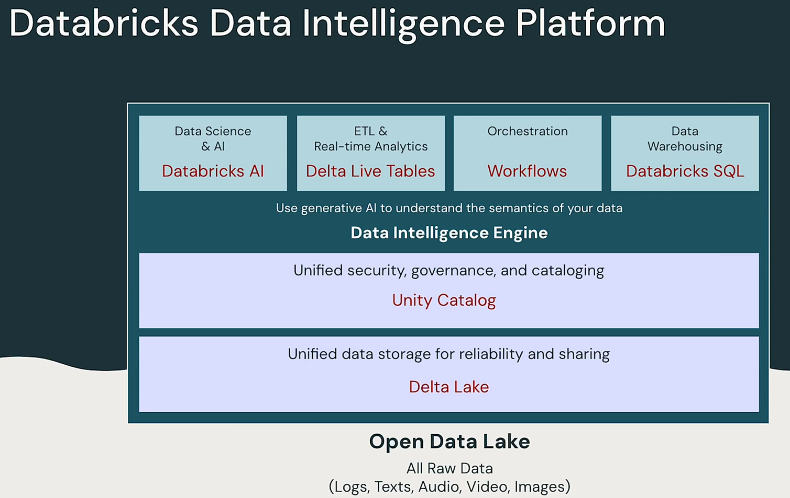

---

## What is the Databricks Data Intelligence Platform?

<!-- IMPORTANTE: Esta seção responde às perguntas "Descreva a Databricks como um negócio", "Explique a Databricks DI Platform" e "Dê exemplos de como a Databricks DI Platform resolve os desafios da indústria" -->

O objetivo da Databricks sempre foi democratizar sua tecnologia e compartilhá-la com outras empresas.

A Databricks é pioneira em IA generativa, com a aquisição da **Mosaic ML em 2023**.

Os fundadores da Databricks são os criadores de muitos dos projetos open source mais famosos do mundo usados em dados e IA, como **Delta Lake**, **MLflow** e **Apache Spark**.

Dados e IA são requisitos para qualquer empresa de sucesso. Mas por que é tão difícil ter sucesso nessas áreas?

A resposta é que para ter sucesso é necessário comprar várias tecnologias e unificá-las de maneira coerente para criar um ambiente ideal de desenvolvimento. Então o que começou com um simples problema de armazenamento evoluiu para um grande ecossistema de dados.

**Três problemas principais atrasam empresas:**

### 1° Data, IA e Governança são isoladas

Um pouco de dados isolados em cada canto do ecossistema dificulta MUITO a governança. Fazer políticas de segurança e controlar custos de todas essas diferentes plataformas é muito complicado, e se você juntar IA Generativa, isso só agrega ainda mais ao problema.

### 2° IA causa desafios para Privacidade & Controle de dados

A introdução de tanta IA causa problemas de privacidade e controle.

### 3° Altamente dependente em profissionais de alto nível

Para fazer tudo isso acontecer, existem muito poucos indivíduos no mercado de trabalho com habilidades para tal. Então, para as empresas funcionarem, precisam de empregados de alto nível — e se não os têm, dificilmente terão seus dados e IA desenvolvidos.

---

#### É justamente aí onde a Databricks Data Intelligence Platform entra.

  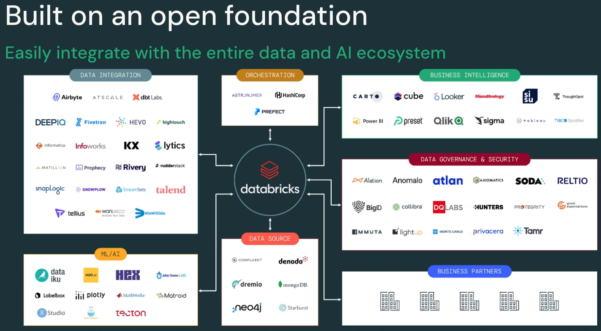

Tendo tudo como um grande ecossistema integrado e colaborativo, a plataforma se torna um recurso essencial para qualquer empresa que queira usar IA ou manipular dados.

  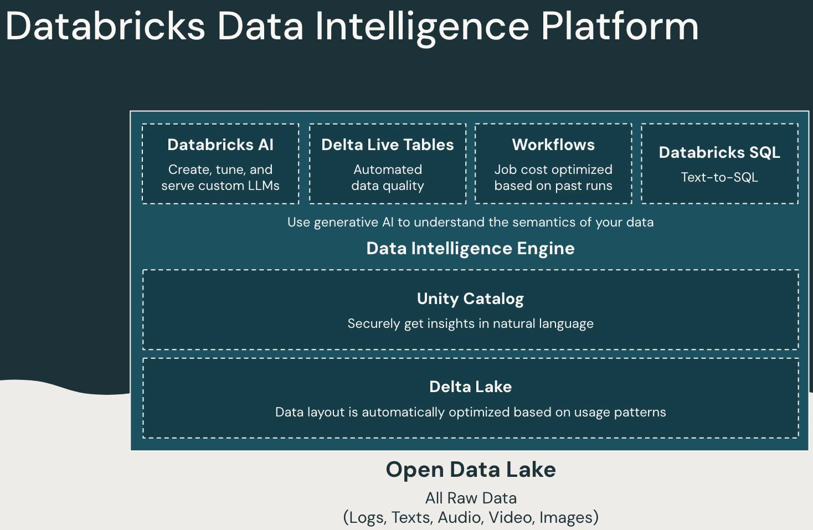

#### Também existe uma ferramenta nova que eleva toda a plataforma a um nível maior: o **Project Genie**

<!-- IMPORTANTE: Esta seção responde à pergunta "Descreva como a Databricks DI Platform beneficia praticantes de dados e usuários não técnicos" — o Project Genie é a ferramenta que democratiza o acesso para não técnicos -->

  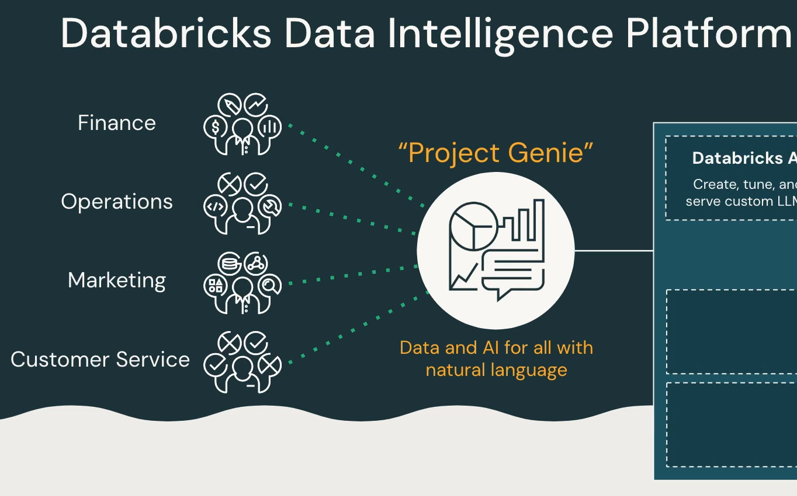

Similar ao Copilot, ele auxilia a conseguir respostas corretas a partir dos dados. É:

- **Simples** — simplifica sua data platform
- **Inteligente** — entende o contexto da organização
- **Privado** — não existe vazamento de informações sensíveis

---

## Databricks DI Platform Architecture and Security Fundamentals

<!-- IMPORTANTE: Esta seção responde às perguntas "Descreva a arquitetura fundamental da Databricks DI Platform", "Descreva a importância do Delta Lake", "Descreva a importância do Unity Catalog", "Diferencie Control Plane do Data Plane" e "Reconheça recursos de segurança da Databricks DI Platform" -->

Neste tópico o objetivo é desenvolver o conhecimento da arquitetura da plataforma.

Antes do resumo de cada parte importante, vamos falar sobre **Delta Lake**:

  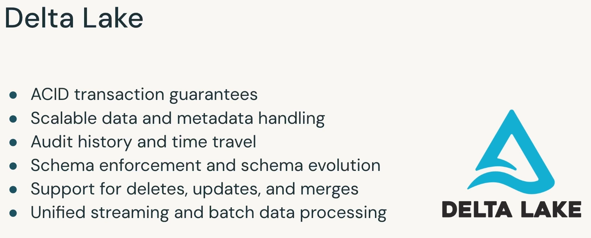

O **Delta Lake** é uma camada de armazenamento inteligente da Databricks criada para melhorar os Data Lakes tradicionais. Ele funciona em cima do armazenamento de dados bruto e adiciona recursos avançados de confiabilidade, desempenho e controle.

Em um Data Lake comum, os dados podem ficar desorganizados, duplicados ou inconsistentes com o tempo. O Delta Lake resolve esse problema utilizando:

- Transações ACID
- Versionamento de dados
- Otimização automática
- Controle de alterações
- Processamento em batch e streaming ao mesmo tempo

Uma das principais vantagens é o **versionamento dos dados** — permite recuperar versões antigas de tabelas, desfazer erros e acompanhar mudanças feitas ao longo do tempo.

Ele também melhora muito a **performance das consultas**, organizando automaticamente os arquivos e otimizando a forma como os dados são armazenados e lidos.

Além disso, o Delta Lake garante maior **confiabilidade em pipelines de dados**, evitando corrupção e inconsistências durante escritas simultâneas.

Na prática, ele serve como a base moderna para engenharia de dados, analytics e IA dentro da Databricks — permitindo trabalhar com grandes volumes de dados de forma rápida, segura, organizada e escalável.

  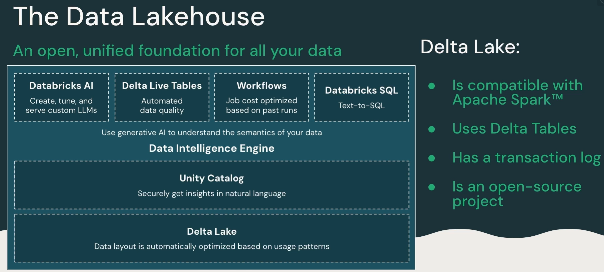

### Apache Spark

O **Apache Spark** é um motor de processamento de dados distribuído muito usado em Big Data. Ele permite:

- Processar enormes volumes de dados
- Fazer análises rápidas
- Executar machine learning
- Trabalhar com streaming

Quando se diz que o Delta Lake é *"compatible with Apache Spark"*, significa que ele funciona integrado ao Spark, aproveitando toda a velocidade e escalabilidade da ferramenta — permitindo processar dados massivos com alta performance.

### Delta Tables

**Delta Tables** são tabelas especiais criadas usando o formato Delta Lake. Diferente de arquivos comuns, elas possuem:

- Versionamento
- Histórico de alterações
- Controle de transações
- Otimização automática

Essas tabelas tornam os dados muito mais confiáveis e organizados. Por exemplo: várias pessoas podem escrever dados ao mesmo tempo, consultas ficam mais rápidas e erros podem ser revertidos.

### Transaction Log

O **Transaction Log** é um registro interno que guarda todas as mudanças feitas nas Delta Tables. Ele salva informações como:

- Inserções
- Exclusões
- Atualizações
- Versões antigas

Funciona como um "histórico completo" das operações, garantindo consistência dos dados, recuperação de falhas, versionamento e auditoria.

---

### Unity Catalog

  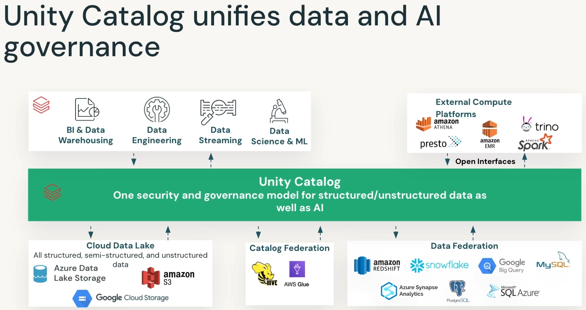

O **Unity Catalog** é a camada de governança e segurança da Databricks. Foi criado para centralizar o controle de dados, permissões e recursos de IA em um único lugar.

A ideia principal é **unificar toda a gestão dos dados da empresa**, mesmo que estejam espalhados em diferentes plataformas, bancos ou clouds.

**O Unity Catalog controla:**

- Quem pode acessar os dados
- Quais tabelas existem
- Onde os dados estão
- Histórico de uso
- Auditoria
- Segurança
- Governança de IA e Machine Learning

Ele funciona como um "gerenciador central" dos dados da empresa.

#### Unified View

  

Facilita pesquisa, classificação e organização de dados estruturados ou não estruturados, como também modelos ML ou pastas diversas.

Um de seus outros benefícios é o **Single Permission Model** — permite que todos os dados e AI assets possam ser acessados em uma única interface.

Também possui uma **monitoração e geração de relatórios movidos por IA**, que concede alertas proativos, data lineage em tempo real e dashboards de geração automática — com uma clara visão end-to-end (tempo real) do fluxo e consumo de dados.

---

### Data Governance

**Elementos Principais de Governança de Dados**

  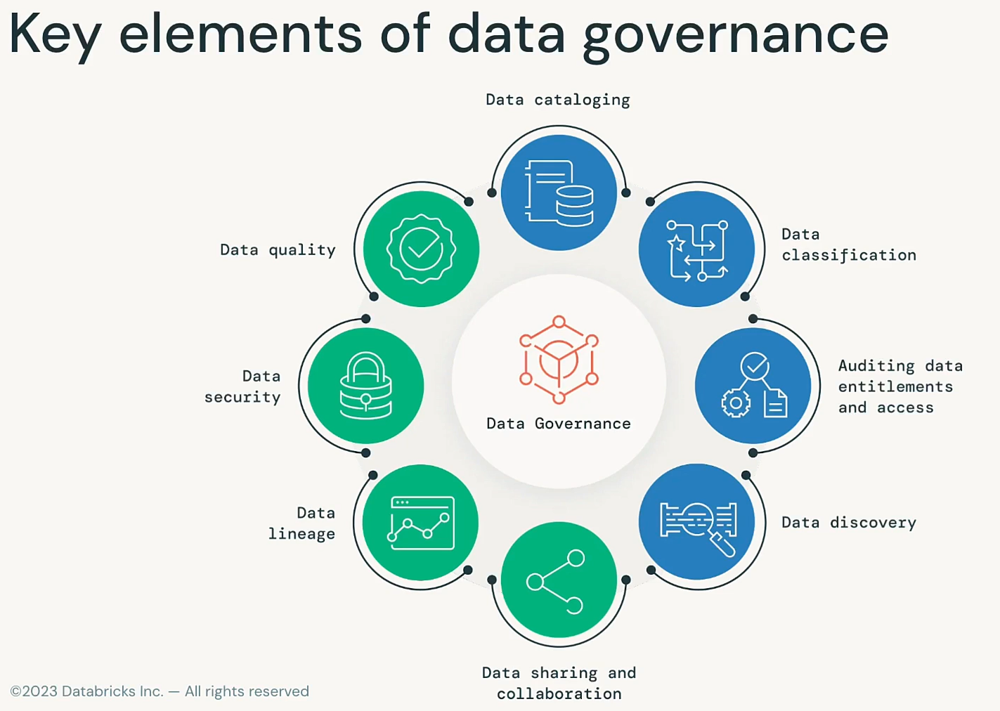

**Data Governance** é o conjunto de práticas usadas para organizar, proteger e controlar os dados da empresa, garantindo que sejam seguros, confiáveis, organizados e acessíveis corretamente.

#### Data Cataloging

Organiza e documenta os dados. Funciona como um "catálogo" mostrando quais dados existem, onde estão e para que servem — facilitando encontrar informações rapidamente.

#### Data Classification

Classifica os dados por tipo e sensibilidade — dados públicos, confidenciais, financeiros, pessoais — ajudando a aplicar segurança adequada para cada tipo.

#### Auditing Data Entitlements and Access

Monitora quem acessa os dados e quais permissões possui. Serve para auditoria, rastreamento e conformidade — permitindo identificar acessos indevidos.

#### Data Discovery

Ajuda usuários a encontrar dados úteis dentro da organização, facilitando pesquisas, análises e reutilização de datasets — reduzindo tempo procurando informações.

#### Data Sharing and Collaboration

Permite compartilhar dados entre equipes e sistemas, melhorando colaboração, integração e produtividade — possibilitando que diferentes áreas trabalhem com os mesmos dados.

#### Data Lineage

Mostra a origem e o caminho dos dados: de onde vieram, transformações realizadas e destino final — facilitando entender e rastrear pipelines de dados.

#### Data Security

Protege os dados contra acessos indevidos com permissões, autenticação e criptografia.

#### Data Quality

Garante que os dados estejam corretos e confiáveis, verificando erros, duplicações e inconsistências — melhorando a qualidade das análises e decisões.

---

#### Hoje em dia, data e AI governance é difícil.

Existem problemas ao implementar ecossistemas com governança:

- **Visão fragmentada do data estate** → ritmo de inovação reduzido
- **Muitas ferramentas para manejar acesso** → risco de data breach aumentado e custos operacionais elevados
- **Monitoração e visibilidade incompleta** → risco reputacional
- **Falta de compartilhamento entre plataformas** → silos de dados

  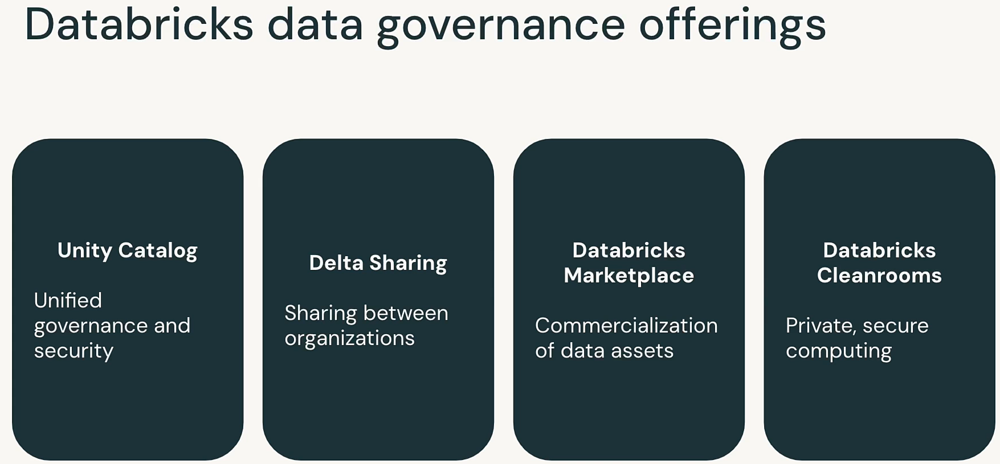

---

### Delta Sharing

  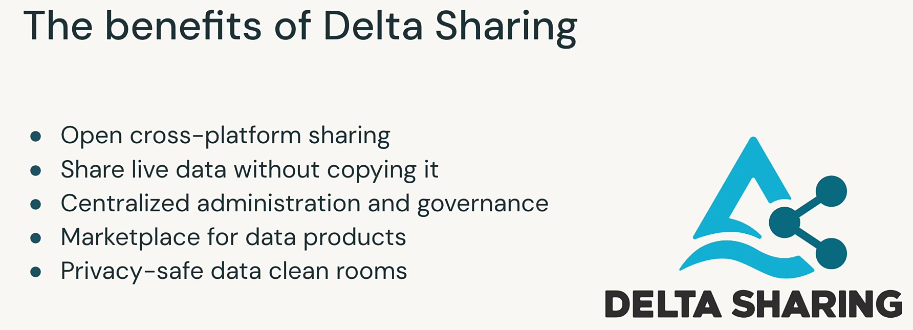

O **Delta Sharing** é uma tecnologia aberta da Databricks usada para compartilhar dados entre empresas, equipes e plataformas de forma segura. Ele permite compartilhar dados em tempo real **sem precisar copiar ou mover arquivos**.

Funciona com diferentes ferramentas e clouds, como Databricks, Power BI, Pandas, Spark e Snowflake. O compartilhamento acontece através de permissões controladas, mantendo segurança e governança dos dados.

### Data Marketplace

O **Data Marketplace** é um ambiente onde empresas e usuários podem compartilhar, vender ou consumir conjuntos de dados de forma organizada. Funciona como um "mercado de dados", permitindo acessar dados prontos para análise sem precisar coletar tudo manualmente.

No contexto da Databricks, ele facilita:

- Descoberta de datasets
- Compartilhamento seguro
- Integração entre empresas
- Colaboração de dados

Os dados podem incluir informações financeiras, de marketing, logística, analytics e IA — com governança e permissões controladas.

### Databricks Clean Room

O **Databricks Clean Room** é um ambiente seguro criado para compartilhar e analisar dados entre empresas **sem expor os dados brutos**. Permite que diferentes organizações colaborem usando seus dados de forma privada e controlada.

Por exemplo: duas empresas podem comparar informações, gerar análises conjuntas, treinar IA ou fazer marketing compartilhado — tudo isso sem que uma empresa veja diretamente os dados sensíveis da outra.

O Clean Room utiliza governança, permissões, isolamento seguro e controle de acesso. Funciona integrado ao Unity Catalog e ao Delta Sharing, garantindo conformidade com leis como **LGPD** e **GDPR**.

---

### Control Plane

  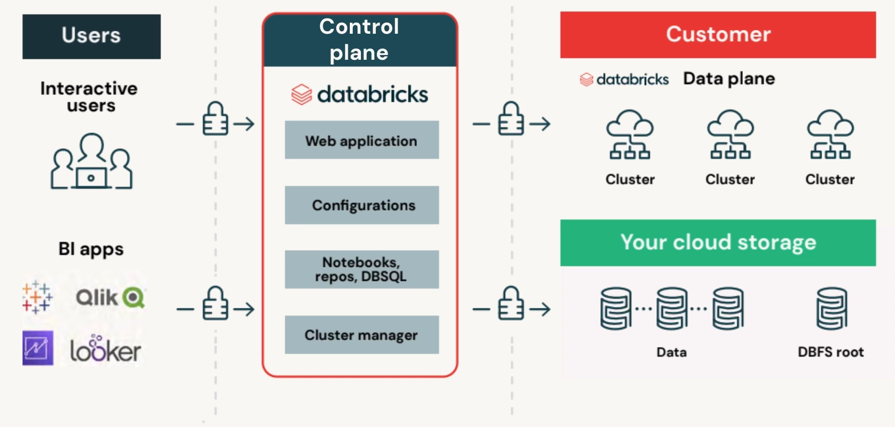

O **Control Plane** é a camada de gerenciamento da plataforma. Ele controla e coordena toda a infraestrutura e os serviços da Databricks, mas normalmente não armazena os dados principais da empresa.

**O que o Control Plane gerencia:**

- Interface web
- Notebooks
- Autenticação e permissões
- Clusters e jobs
- APIs
- Monitoramento
- Unity Catalog
- Orquestração geral

Pense nele como o **"centro de comando"** da plataforma. Quando você cria um cluster, executa um notebook, agenda um workflow ou configura permissões — tudo passa pelo Control Plane.

#### Data Plane

O **Data Plane** é a camada onde o processamento real dos dados acontece. É nela que os dados são lidos, transformados, processados e analisados. Inclui máquinas virtuais, clusters Spark, armazenamento, execução de queries, pipelines e processamento de IA.

Quando um Spark Job roda — lê dados do S3, processa milhões de linhas, treina um modelo — tudo acontece no Data Plane.

**Relação entre os dois:**

- O **Control Plane** envia comandos e gerencia
- O **Data Plane** executa o trabalho pesado

> Analogia: em um restaurante, o Control Plane seria o gerente e o sistema de pedidos; o Data Plane seriam os cozinheiros e o fogão.

Na Databricks, normalmente o Control Plane fica gerenciado pela Databricks, enquanto o Data Plane roda na cloud do cliente (AWS, Azure ou GCP) — aumentando segurança, isolamento e controle dos dados. Os dados sensíveis permanecem na infraestrutura da própria empresa.

---

### User Identity and Access

<!-- IMPORTANTE: Esta seção responde à pergunta "Reconheça recursos de segurança da Databricks DI Platform" -->

  

#### Table ACLs Feature

**ACLs (Access Control Lists)** são regras de permissão aplicadas nas tabelas. Elas controlam quem pode visualizar, editar, deletar ou executar consultas — garantindo que diferentes usuários possuam acessos diferentes dentro da plataforma.

#### IAM Instance Profiles

**IAM (Identity and Access Management)** é o sistema de permissões da cloud, muito usado na AWS. Os Instance Profiles permitem que clusters da Databricks acessem recursos da cloud com segurança — como acessar S3, ler arquivos e salvar dados — sem precisar colocar credenciais manualmente.

#### Securely Stored Access Key

São chaves de acesso armazenadas de forma segura — tokens, senhas, chaves da cloud, APIs. A Databricks protege essas informações para evitar vazamentos, permitindo que usuários e aplicações autentiquem serviços sem expor credenciais diretamente.

#### Secrets API

A **Secrets API** é um sistema da Databricks usado para armazenar e acessar informações sensíveis como senhas, tokens, chaves de API e credenciais de banco. Ao invés de escrever senhas diretamente no código, elas ficam guardadas em um local seguro — aumentando a segurança e evitando exposição de informações críticas.

---

### Databricks Serverless SQL

<!-- IMPORTANTE: Esta seção responde às perguntas "Descreva os recursos computacionais da Databricks DI Platform", "Serverless Compute, defina" e "Reconheça como a Databricks DI Platform dá suporte a Data Warehousing com Databricks SQL" -->

  

O **Databricks Serverless SQL** é um serviço de SQL totalmente gerenciado pela Databricks, onde você não precisa criar, configurar ou manter clusters manualmente.

O termo *"serverless"* significa exatamente isso: sem gerenciar servidores, sem configurar infraestrutura, sem administrar máquinas — a Databricks faz tudo automaticamente em segundo plano.

**Permite executar:**

- Consultas SQL
- Dashboards
- BI e analytics
- Queries em Big Data

de forma rápida e automática. É muito usado por analistas de dados, equipes de BI, dashboards corporativos e relatórios em tempo real.

**Problemas que ele resolve:**

**1. Elimina gerenciamento de clusters**
Antes era necessário criar cluster, configurar máquinas, escolher tamanho e monitorar recursos. Com Serverless, tudo é automático — reduzindo complexidade operacional.

**2. Resolve problemas de escalabilidade**
Se muitos usuários executarem consultas ao mesmo tempo, o Serverless escala automaticamente — aumenta recursos, distribui carga e otimiza performance, evitando lentidão em horários de pico.

**3. Reduz custo**
Clusters tradicionais podem ficar ligados sem uso. O Serverless inicia sob demanda, desliga automaticamente e cobra apenas pelo uso real — reduzindo desperdício de infraestrutura.

**4. Melhora performance SQL**
A Databricks otimiza automaticamente cache, execução, recursos computacionais e paralelismo — consultas ficam mais rápidas sem ajustes manuais.

**5. Facilita BI e Analytics**
Ferramentas como Power BI, Tableau e Looker podem conectar diretamente — analistas conseguem consultar grandes volumes de dados sem depender da equipe de infraestrutura.

**Como funciona internamente:**

Quando alguém executa uma query, a Databricks cria recursos automaticamente, executa a consulta, otimiza performance e libera recursos quando termina — tudo sem o usuário gerenciar servidores.

**Relação com Data Lakehouse:**

O Serverless SQL acessa dados armazenados em Delta Lake, Unity Catalog e Data Lakes — permitindo usar SQL diretamente sobre grandes volumes de dados modernos.

**Diferença para cluster tradicional:**

| | Cluster Tradicional | Serverless SQL |
|---|---|---|
| Gerenciamento | Você cria, configura e monitora | Databricks gerencia tudo |
| Escalabilidade | Manual | Automática |
| Custo | Paga mesmo parado | Paga apenas pelo uso |

---

### O que é Photon?

  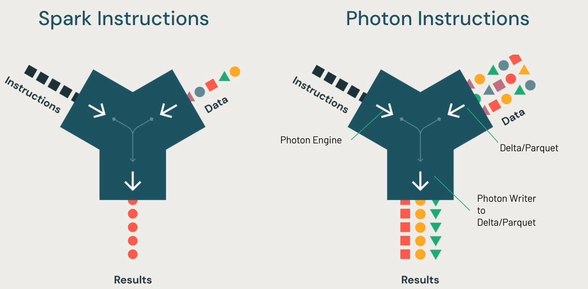

O **Photon** é o mecanismo de processamento de alta performance da Databricks, criado para acelerar consultas SQL, processamento Spark, analytics e Data Engineering usando otimizações em baixo nível.

**O que ele resolve:**

- Lentidão em consultas
- Alto consumo de recursos
- Processamento ineficiente de Big Data

Ele melhora velocidade, paralelismo, uso de CPU e performance de queries — tornando workloads muito mais rápidos e baratos.

**Como funciona:**

O Photon substitui partes do processamento tradicional do Spark por um engine otimizado em **C++**, permitindo melhor uso do hardware, execução vetorizada e processamento mais eficiente.

**Onde é usado:**

- Databricks SQL
- ETL e pipelines de dados
- Data Warehousing
- Analytics em larga escala

**Benefícios:**

- Queries mais rápidas
- Menor custo computacional
- Melhor escalabilidade
- Performance otimizada automaticamente

**Relação com Spark:**

O Photon funciona integrado ao Apache Spark — o Spark continua sendo usado e o Photon acelera a execução interna. Usuários conseguem mais performance sem mudar seus códigos SQL ou Spark.

---

## Supported Workloads on the Databricks DI Platform

<!-- IMPORTANTE: Esta seção responde às perguntas "Reconheça como a Databricks DI Platform dá suporte a Data Warehousing", "Descreva os benefícios de executar Data Warehouse workloads na Databricks DI Platform", "Explique como a Databricks Workflow dá suporte a data orchestration", "Explique como Delta Live Tables dá suporte a tarefas com ETL" e "Descreva como a Databricks DI Platform dá suporte a ciência de dados e tarefas com IA" -->

  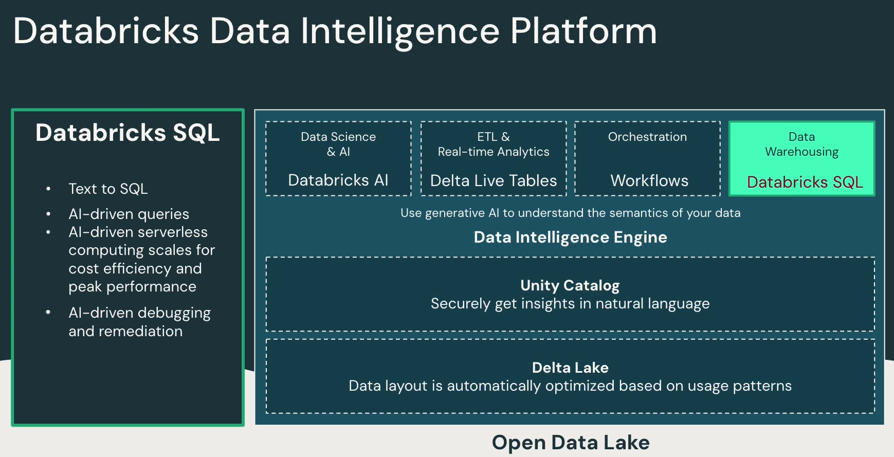

A Databricks Data Intelligence Platform é uma plataforma unificada criada para trabalhar com dados, analytics, engenharia de dados e inteligência artificial no mesmo ambiente. A ideia principal é centralizar tudo que uma empresa precisa para armazenar, processar, analisar e usar dados em IA sem precisar ficar trocando entre várias ferramentas diferentes.

Os dados normalmente ficam armazenados em clouds como AWS S3, Azure Data Lake ou Google Cloud Storage. Em cima desses dados entra o Delta Lake, que adiciona recursos como versionamento, controle de transações, otimização e confiabilidade. Isso transforma um Data Lake comum em algo muito mais seguro e eficiente.

O processamento acontece através do Apache Spark, que é o motor principal da Databricks. Ele distribui o trabalho entre várias máquinas do cluster para processar Big Data rapidamente. Para acelerar ainda mais, existe o Photon, um engine otimizado que melhora consultas SQL e pipelines usando processamento vetorizado e otimizações em baixo nível.

A plataforma também possui o Unity Catalog. Assim a empresa consegue manter tudo centralizado e seguro mesmo trabalhando com muitos times e projetos diferentes.

Na parte de Data Warehousing, a Databricks permite fazer analytics e BI diretamente sobre os dados do Data Lake sem precisar copiar tudo para outro banco específico. O Databricks SQL usa o Photon para executar queries muito rápidas, permitindo integração com Power BI, Tableau e outras ferramentas de visualização.

A plataforma ajuda principalmente a resolver problemas como dados espalhados em vários sistemas, dificuldade de escalar processamento, pipelines complexos, duplicação de dados, baixa performance em analytics e problemas de governança. Em vez de usar uma ferramenta para ETL, outra para BI e outra para IA, tudo fica integrado no mesmo ambiente.

Ela também possui recursos de IA e Machine Learning como MLflow, Mosaic AI, treinamento de modelos e integração com LLMs. Isso permite criar desde pipelines de dados até sistemas de IA generativa dentro da própria plataforma.

Na prática, empresas usam Databricks para engenharia de dados, dashboards, analytics, processamento de Big Data, streaming, Data Science, Machine Learning e IA corporativa em larga escala.

  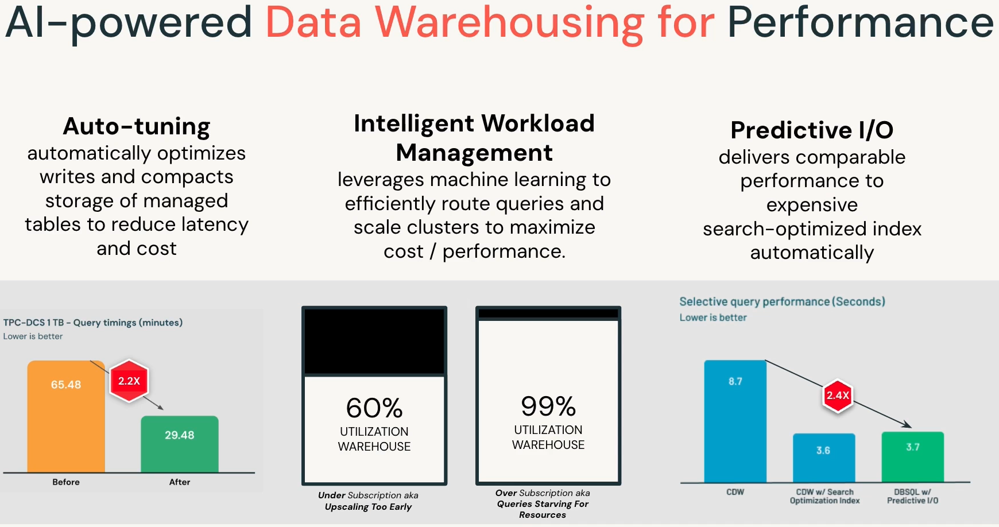

Data warehousing sem IA é lento. Porém, com IA ocorre um grande aumento em performance, tornando-a essencial para Autotuning, Intelligent Workload Management e Previsão de I/O.

Melhora TCO e Performance — determina automaticamente tipos de instanciamento e configuração para melhor preço, com até 12x de melhora comparado a um cloud data warehouse comum. Também uma redução de custo geral de até 40% com serverless.

### Orchestration Workflows

<!-- IMPORTANTE: Esta seção responde às perguntas "Descreva os benefícios de usar automação inteligente em tarefas de data orchestration" e "Explique como a Databricks Workflow dá suporte a data orchestration" -->

  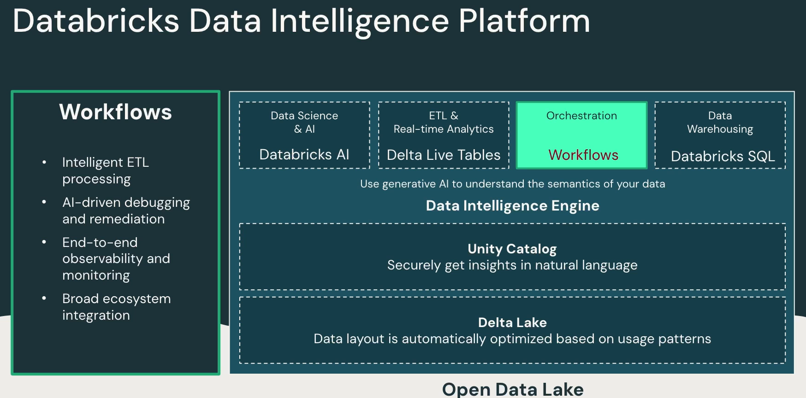

Orchestration Workflows na Databricks é o sistema responsável por automatizar e coordenar tarefas dentro da plataforma. Ele serve para organizar pipelines de dados, controlar execuções e conectar diferentes processos sem precisar fazer tudo manualmente.

A ideia principal é criar fluxos automáticos. Por exemplo, uma empresa pode precisar pegar dados de uma API, salvar no Data Lake, transformar os dados, atualizar tabelas Delta e depois gerar dashboards. O Workflow controla toda essa sequência automaticamente.

Ele funciona como um orquestrador central da plataforma. Em vez de executar notebooks, SQL ou pipelines um por um, o Workflow entende a ordem correta das tarefas e executa tudo automaticamente.

Além disso, ele consegue controlar dependências entre tarefas. Isso significa que uma etapa só começa quando a anterior termina corretamente. Caso aconteça algum erro, o sistema pode tentar novamente automaticamente usando retries.

Os Workflows também ajudam muito na automação operacional porque permitem agendar execuções em horários específicos ou iniciar processos quando novos dados chegam no ambiente.

Dentro da Databricks ele pode executar notebooks Python, Spark Jobs, queries SQL, Delta Live Tables, pipelines de Machine Learning e diversos outros tipos de tarefas. Tudo fica centralizado no mesmo ambiente.

Outro ponto importante é que ele trabalha junto dos clusters e do Serverless Compute. Assim a Databricks consegue criar recursos computacionais automaticamente apenas quando necessário, reduzindo custo e melhorando escalabilidade.

Na arquitetura da Databricks Data Intelligence Platform, os Workflows fazem a ligação entre ingestão de dados, transformação, analytics, governança e IA. Eles ajudam empresas a criar pipelines grandes e complexos de forma organizada, automática e confiável.

Porém, Orchestration sem automação é ineficiente — o tempo de resposta geralmente é atrasado. Quando automatizado, todos esses problemas são aliviados, e o tempo pode ser utilizado em trabalhos mais importantes.

  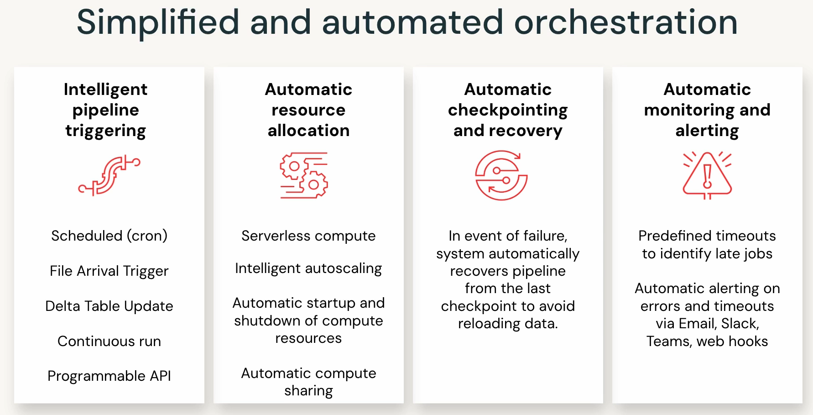

Uma Orchestration simplificada e automatizada inclui 4 passos importantes:

**Intelligent Pipeline Triggering**

Ativa pipelines automaticamente quando novos dados chegam ou quando uma condição é atendida, evitando execuções manuais e desperdício de recursos.

**Automatic Resource Allocation**

A Databricks ajusta automaticamente os recursos computacionais conforme a necessidade do processamento, melhorando performance e reduzindo custo.

**Automatic Checkpointing and Recovery**

Salva automaticamente o progresso do processamento para permitir recuperação rápida em caso de falhas, sem perder dados.

**Automatic Monitoring and Alerting**

Monitora pipelines e serviços em tempo real e envia alertas automaticamente quando ocorre erro, falha ou comportamento anormal.

A Databricks também otimiza automaticamente os workflows para serverless compute, então os usuários podem focar em seu trabalho com dados em vez de lidar com seus clusters. Também protege projetos críticos de interrupções na cloud.

## Delta Live Tables, ETL & Real Time Analytics

<!-- IMPORTANTE: Esta seção responde às perguntas "Explique como Delta Live Tables (DLT) dá suporte a tarefas com ETL" e "Descreva os benefícios de integrar DLT e capacidades de IA usadas para otimizar pipelines ETL" -->

  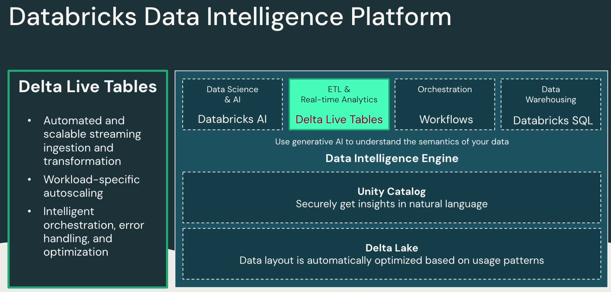

Delta Live Tables, ou DLT, é uma ferramenta da Databricks criada para automatizar pipelines de dados e facilitar processos de Data Engineering. O principal objetivo é reduzir a complexidade de construir, manter e monitorar pipelines grandes e escaláveis.

Antes do DLT, engenheiros precisavam configurar manualmente execução de jobs, dependências, monitoramento, recuperação de falhas e validação de dados. Isso tornava pipelines difíceis de manter e mais sujeitos a erros.

O Delta Live Tables resolve esse problema automatizando praticamente toda a infraestrutura operacional do pipeline. O usuário apenas define como os dados serão transformados usando SQL ou Python, enquanto a Databricks controla a execução automaticamente.

Ele utiliza o Delta Lake como base de armazenamento, então trabalha diretamente com Delta Tables e aproveita recursos como versionamento, transações ACID, confiabilidade e alta performance. Também usa Apache Spark internamente para processamento distribuído e escalável.

O DLT possui recursos automáticos como monitoramento, retries, checkpointing, recuperação de falhas, gerenciamento de dependências e validação da qualidade dos dados. Isso ajuda a criar pipelines muito mais confiáveis.

Ele também é muito usado junto da arquitetura Medallion, organizando dados em camadas Bronze, Silver e Gold para separar dados brutos, tratados e prontos para analytics.

Outro ponto importante é que suporta batch e streaming ao mesmo tempo, permitindo pipelines em tempo real dentro da Databricks.

Na prática, empresas usam Delta Live Tables para ETL, ingestão de dados, pipelines de Big Data, processamento em streaming, analytics e preparação de dados para IA e BI.

### ETL pipeline é "fácil"

  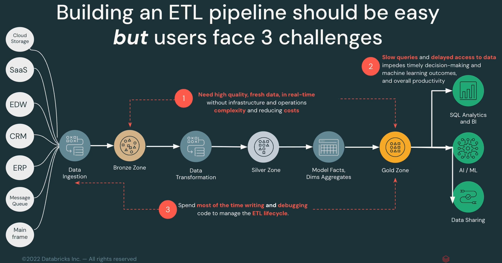

Porém existem 3 problemas que usuários enfrentam ao aplicar ETL:

1° Necessidade de dados novos e de alta qualidade em tempo real, sem estruturas e operações complexas, com redução de custos.

2° Queries lentas e acesso atrasado a dados impedem o tempo de decisão, a saída de machine learning e a produtividade em geral.

3° A maior parte do tempo é gasta escrevendo e depurando código para suprir o ciclo de vida do ETL.

Ao usar IA, podemos resolver esses problemas:

  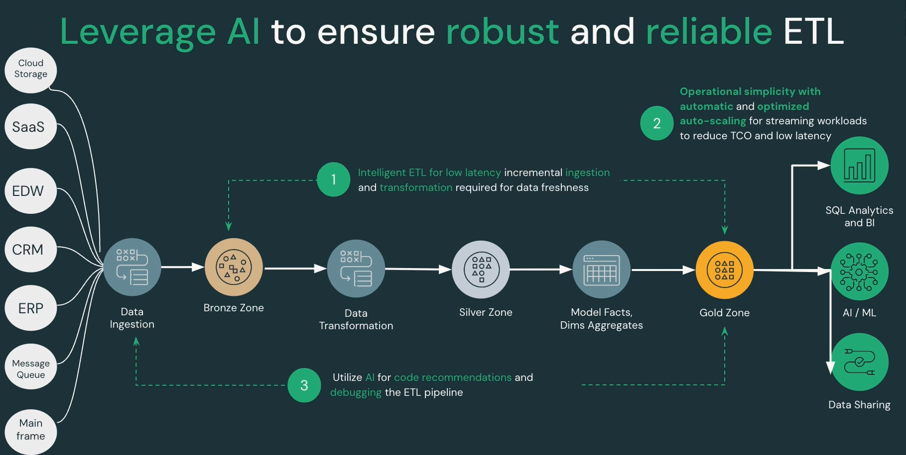

1° ETL inteligente para baixa latência em ingestão incremental e transformação necessária para dados novos.

2° Simplicidade operacional com autoscaling automático e otimizado para streaming workloads, reduzindo latência e TCO.

3° Utiliza IA para depurar o pipeline ETL e recomendar código.

Isso poupa tempo ao profissional, permitindo gerir seu tempo com outras atividades.

### Data Science & IA

<!-- IMPORTANTE: Esta seção responde às perguntas "Explique os desafios enfrentados por empresas ao tentar utilizar o poder do Machine Learning e IA" e "Descreva como a Databricks DI Platform dá suporte a ciência de dados e tarefas com IA" -->

Como a IA sofreu uma explosão e seu uso apenas aumentará, é importante dominá-la o quanto antes para usufruir de seus benefícios.

Porém, atualmente a utilização de IA generativa possui seus próprios problemas: data leakage, falta de controle, necessidade de maior automatização, performance imprevisível, modelos de fundação caros em escala e custo elevado para montar LLMs.

É por isso que empresas implementam melhor a GenIA com Databricks — você precisa mais do que bons modelos.

A Databricks oferece: propriedade total sobre o modelo e os dados, deploy mais confiável e rápido através de diversos casos de uso, e é cost-effective para construir LLMs em escala.

  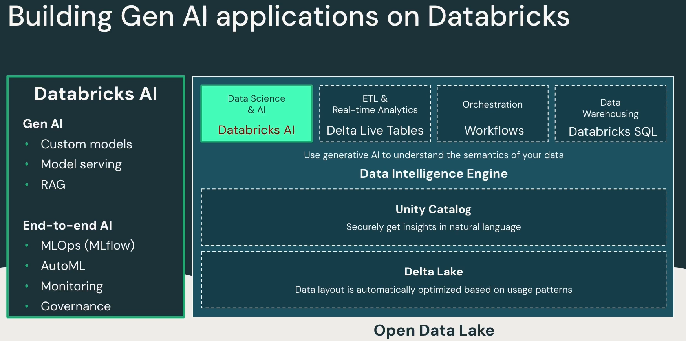

Databricks AI para IA Generativa:

71% dos executivos planejam criar alguns ou todos os seus próprios modelos (Custom Models).

MLflow oferece modelos eficientes para produção (Model Serving).

Treine ou faça fine-tune do seu próprio modelo de IA generativa com seus dados em seu próprio ambiente seguro (Retrieval Augmented Generation — RAG).

Para uma plataforma de IA, é importante que a maioria das coisas seja centrada nos dados, tudo unificado em um único lugar.

  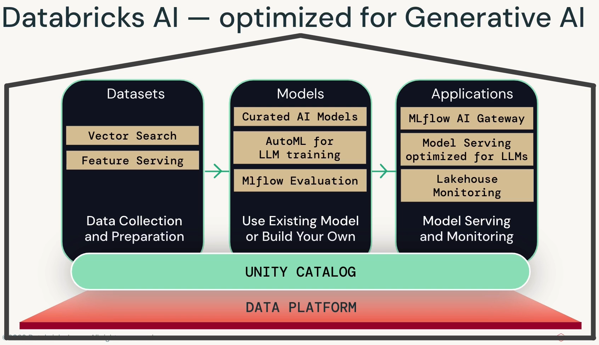

É importante realizar essas 3 etapas em uma única plataforma de dados em vez de sistemas separados, pois a parte mais difícil é coletar os dados — e isso é feito melhor com a coexistência de tudo em uma única plataforma.

---

## **PERGUNTAS SOBRE O CURSO**

### Descreva a origem e propósito das plataformas de data management.

Clique para ver a resposta

A origem das plataformas de dados surgiu da necessidade de centralizar e unificar informações. O que inicialmente era apenas um problema de armazenamento acabou gerando novas demandas relacionadas a processamento, escalabilidade, analytics, governança e inteligência artificial.

Com isso, surgiram arquiteturas como Data Warehouse, Data Lake e posteriormente o Data Lakehouse, dando origem a plataformas modernas como a Databricks, cujo objetivo é democratizar dados e IA.

Data Warehouse → Data Lake → Data Lakehouse → Data Intelligence Platform

### Explique os desafios de gerenciar e usar Big Data.

Clique para ver a resposta

Os desafios surgem devido à grande quantidade de dados que podem ficar isolados dentro das empresas. Além disso, a variedade de dados estruturados, semiestruturados e não estruturados torna o gerenciamento muito mais complexo, causando problemas de organização, performance e escalabilidade.

Uma das soluções para isso foi o surgimento de tecnologias especializadas em processamento e armazenamento de dados. Porém, muitas dessas tecnologias funcionavam bem para determinados tipos de dados, mas apresentavam limitações para outros cenários.

Por conta disso, surgiram plataformas como a Databricks, que utiliza a arquitetura Lakehouse para unificar processamento, analytics, governança e inteligência artificial em um único ambiente. Além disso, ferramentas como o Unity Catalog ajudam na organização, segurança e gerenciamento dos dados, resolvendo grande parte dos problemas relacionados à fragmentação e complexidade dos ambientes de dados modernos.

### Descreva como plataformas de gestão de dados evoluíram para ser plataformas de dados inteligentes.

Clique para ver a resposta

Com a explosão da Inteligência Artificial, principalmente da IA generativa, a quantidade e variedade de dados cresceram de forma acelerada. As plataformas tradicionais de gerenciamento de dados, que antes eram focadas apenas em armazenamento, processamento e analytics, passaram a enfrentar novos desafios relacionados à escalabilidade, governança, monitoramento e integração com IA.

Esse novo cenário impulsionou a evolução das plataformas de dados para plataformas inteligentes. Em vez de apenas armazenar e processar informações, essas plataformas passaram a utilizar IA para compreender contexto, automatizar tarefas e auxiliar usuários durante todo o ciclo de vida dos dados.

A Databricks representa essa evolução através da Data Intelligence Platform, utilizando IA generativa integrada para auxiliar em atividades como depuração, geração de queries SQL, monitoramento, gerenciamento de pipelines, otimização de workloads e análise de dados.

Assim, as plataformas modernas deixaram de ser apenas ambientes de gerenciamento de dados e passaram a atuar como sistemas inteligentes capazes de aumentar produtividade, automação e eficiência operacional.

### Descreva a Databricks como um negócio.

Clique para ver a resposta

A Databricks é uma empresa de tecnologia fundada em 2013, com sede em São Francisco, EUA. Seu modelo de negócio é baseado em oferecer uma plataforma unificada de dados e IA — a Data Intelligence Platform — como serviço em cloud (SaaS), sendo compatível com AWS, Azure e GCP.

A empresa foi fundada pelos criadores do Apache Spark e é responsável por projetos open source amplamente utilizados na indústria, como Delta Lake e MLflow. Em 2023, adquiriu a Mosaic ML, consolidando sua liderança em IA generativa.

O objetivo central da Databricks é democratizar o acesso a dados e IA para empresas de todos os tamanhos, eliminando a necessidade de múltiplas ferramentas isoladas ao centralizar armazenamento, processamento, analytics, governança e IA em um único ambiente.

Seu público-alvo inclui engenheiros de dados, cientistas de dados, analistas, times de BI e executivos que precisam tomar decisões baseadas em dados. A plataforma atende desde startups até grandes corporações em setores como finanças, saúde, varejo e tecnologia.

### Explique a Databricks Data Intelligence (DI) Platform.

Clique para ver a resposta

A Databricks Data Intelligence Platform é uma plataforma unificada que combina armazenamento, processamento, analytics, governança e inteligência artificial em um único ambiente na cloud.

Ela é construída sobre a arquitetura Lakehouse, que une os melhores aspectos dos Data Lakes (flexibilidade e baixo custo de armazenamento) com os dos Data Warehouses (confiabilidade, performance e controle). A base de armazenamento é o Delta Lake, que garante transações ACID, versionamento e alta confiabilidade.

O processamento é feito pelo Apache Spark, com aceleração adicional do Photon — um engine em C++ para alta performance em queries SQL e pipelines. A governança é centralizada no Unity Catalog, que controla permissões, auditoria, data lineage e segurança de todos os dados e modelos de IA.

A plataforma suporta workloads de Data Warehousing, ETL, orquestração de pipelines, streaming em tempo real, Data Science e IA generativa — tudo no mesmo ambiente, sem necessidade de ferramentas externas.

Com a integração de IA generativa, a plataforma também oferece recursos como o Project Genie, que permite que usuários técnicos e não técnicos interajam com os dados em linguagem natural.

### Dê exemplos de como a Databricks DI Platform resolve os desafios da indústria liderando negócios.

Clique para ver a resposta

**Problema: dados isolados em múltiplos sistemas**
A Databricks resolve esse problema centralizando todos os dados no Data Lakehouse com Delta Lake e Unity Catalog, eliminando silos e permitindo que times diferentes acessem os mesmos dados com segurança e governança unificada.

**Problema: pipelines ETL complexos e sujeitos a erros**
Com Delta Live Tables (DLT), a plataforma automatiza a criação, monitoramento e recuperação de falhas em pipelines ETL, reduzindo o tempo gasto em manutenção e depuração de código.

**Problema: analytics lento em grandes volumes de dados**
O Databricks SQL com Photon permite executar queries em Big Data com alta performance, integrando diretamente com ferramentas de BI como Power BI e Tableau — sem precisar mover dados para outro sistema.

**Problema: custo alto com infraestrutura**
O Serverless Compute elimina a necessidade de gerenciar clusters manualmente. Os recursos são criados sob demanda e encerrados automaticamente, reduzindo custos operacionais em até 40%.

**Problema: dificuldade em implementar IA generativa com segurança**
A Databricks oferece um ambiente seguro para treinar e fazer fine-tune de modelos de IA com os próprios dados da empresa, sem risco de data leakage, com suporte a RAG e MLflow para produção de modelos.

### Descreva como a Databricks DI Platform beneficia praticantes de dados e usuários não técnicos de dados.

Clique para ver a resposta

**Para praticantes de dados (engenheiros, cientistas, analistas):**

A plataforma oferece um ambiente unificado onde engenheiros de dados podem construir pipelines com Delta Live Tables, cientistas de dados podem treinar e versionar modelos com MLflow, e analistas podem executar queries SQL de alta performance com o Databricks SQL e Photon. A orquestração com Workflows automatiza tarefas repetitivas, e o Unity Catalog garante governança e segurança sem esforço adicional.

**Para usuários não técnicos (executivos, gestores, áreas de negócio):**

O Project Genie permite que usuários sem conhecimento técnico interajam com os dados em linguagem natural, obtendo respostas e insights sem precisar escrever código ou depender de um analista. Dashboards automáticos e relatórios gerados por IA no Unity Catalog também facilitam o consumo de informações para tomada de decisão.

Em resumo, a plataforma democratiza o acesso a dados e IA — técnicos ganham produtividade, e não técnicos ganham autonomia.

### Descreva a arquitetura fundamental da Databricks DI Platform.

Clique para ver a resposta

A arquitetura da Databricks DI Platform é dividida em duas camadas principais:

**Control Plane:** é a camada de gerenciamento, responsável pela interface web, notebooks, autenticação, permissões, clusters, jobs, APIs e orquestração. É gerenciado pela própria Databricks.

**Data Plane:** é a camada onde o processamento real acontece — leitura, transformação, análise e armazenamento dos dados. Roda na infraestrutura do cliente (AWS, Azure ou GCP), garantindo que os dados sensíveis nunca saiam do ambiente da empresa.

A base de armazenamento é o **Delta Lake**, que adiciona confiabilidade, versionamento e transações ACID sobre os Data Lakes. O processamento é feito pelo **Apache Spark**, acelerado pelo **Photon**. A governança é centralizada no **Unity Catalog**, que controla permissões, auditoria e data lineage de todos os assets.

Sobre essa base, a plataforma suporta workloads de Data Warehousing (Databricks SQL), orquestração (Workflows), ETL em tempo real (Delta Live Tables), Data Science e IA generativa (MLflow, Mosaic AI).

### Descreva a importância do Delta Lake, incluindo seus recursos e benefícios.

Clique para ver a resposta

O Delta Lake é a camada de armazenamento inteligente da Databricks, construída sobre os Data Lakes tradicionais. Sua importância está em resolver os principais problemas de confiabilidade e qualidade de dados que os Data Lakes comuns não conseguiam resolver.

**Recursos principais:**
- Transações ACID — garante consistência mesmo com escritas simultâneas
- Versionamento de dados — permite recuperar versões anteriores e desfazer erros
- Otimização automática — organiza arquivos e melhora performance de leitura
- Controle de alterações — rastreia todas as modificações via Transaction Log
- Suporte a batch e streaming simultaneamente

**Benefícios:**
- Dados mais confiáveis e organizados
- Pipelines mais seguros, sem risco de corrupção
- Performance superior em queries e analytics
- Base sólida para IA e Machine Learning
- Integração nativa com Apache Spark

Na prática, o Delta Lake transforma um Data Lake simples em um ambiente de dados moderno, confiável e escalável — servindo como fundação para toda a plataforma Databricks.

### Descreva a importância do Unity Catalog, incluindo seus recursos e benefícios.

Clique para ver a resposta

O Unity Catalog é a camada central de governança e segurança da Databricks. Sua importância está em resolver um dos maiores desafios das empresas modernas: gerenciar dados, permissões e ativos de IA de forma centralizada, mesmo que estejam espalhados em diferentes plataformas e clouds.

**Recursos principais:**
- Single Permission Model — controle de acesso unificado para todos os dados e modelos
- Data Lineage em tempo real — rastreia origem, transformações e destino dos dados
- Auditoria completa — registra todos os acessos e operações
- Data Discovery — facilita encontrar e reutilizar dados dentro da organização
- Monitoração por IA — alertas proativos e dashboards automáticos
- Suporte a Delta Sharing e Clean Rooms para colaboração segura entre empresas

**Benefícios:**
- Governança centralizada sem necessidade de múltiplas ferramentas
- Redução de risco de data breach
- Conformidade com leis como LGPD e GDPR
- Maior produtividade para times técnicos e não técnicos
- Visão end-to-end do fluxo de dados em tempo real

### Diferencie Control Plane do Data Plane.

Clique para ver a resposta

**Control Plane** é a camada de gerenciamento da plataforma. Ele controla e coordena toda a infraestrutura e os serviços da Databricks — interface web, notebooks, autenticação, permissões, clusters, jobs, APIs, monitoramento e orquestração. É gerenciado diretamente pela Databricks e não processa os dados principais da empresa.

**Data Plane** é a camada onde o processamento real dos dados acontece. É nela que os dados são lidos, transformados, processados e analisados — através de máquinas virtuais, clusters Spark, armazenamento e execução de pipelines. Roda na infraestrutura do próprio cliente (AWS, Azure ou GCP).

**Diferença principal:** o Control Plane gerencia e coordena; o Data Plane executa o trabalho pesado. Os dados sensíveis da empresa ficam sempre no Data Plane — dentro da infraestrutura do cliente — enquanto a Databricks administra a plataforma pelo Control Plane sem ter acesso direto aos dados.

### Reconheça recursos de segurança da Databricks DI Platform.

Clique para ver a resposta

A Databricks DI Platform oferece múltiplas camadas de segurança:

**Table ACLs (Access Control Lists):** regras de permissão aplicadas diretamente nas tabelas, controlando quem pode visualizar, editar, deletar ou executar queries.

**IAM Instance Profiles:** permite que clusters acessem recursos da cloud (como S3) de forma segura e automatizada, sem necessidade de inserir credenciais manualmente no código.

**Securely Stored Access Keys:** tokens, senhas e chaves de API são armazenados de forma protegida pela plataforma, evitando exposição de credenciais.

**Secrets API:** sistema para armazenar e acessar informações sensíveis fora do código — senhas, tokens e chaves ficam em um cofre seguro dentro da plataforma.

**Unity Catalog:** centraliza governança, auditoria, data lineage e controle de acesso para todos os dados e modelos de IA.

**Arquitetura Control Plane / Data Plane:** os dados sensíveis permanecem na infraestrutura do cliente, enquanto a Databricks gerencia a plataforma pelo Control Plane — garantindo isolamento e conformidade.

**Delta Sharing e Clean Rooms:** permitem colaboração entre empresas sem expor dados brutos, mantendo privacidade e conformidade com LGPD e GDPR.

### Descreva os recursos computacionais da Databricks DI Platform.

Clique para ver a resposta

A Databricks DI Platform oferece diferentes tipos de recursos computacionais para atender a diferentes necessidades:

**Clusters Apache Spark:** o recurso computacional principal da plataforma. São conjuntos de máquinas virtuais que processam dados de forma distribuída. Podem ser configurados manualmente em tamanho, tipo de instância e tempo de vida.

**Serverless Compute:** recurso gerenciado automaticamente pela Databricks. Não requer criação ou configuração manual de clusters — os recursos são criados sob demanda, escalam automaticamente conforme a carga e são encerrados quando não há uso, cobrando apenas pelo tempo utilizado.

**Photon Engine:** engine de processamento em C++ integrado ao Spark, que acelera consultas SQL e pipelines com execução vetorizada e otimizações em baixo nível — sem necessidade de alterar o código existente.

**Databricks SQL Warehouses:** recursos computacionais dedicados a consultas SQL e BI, com suporte a Serverless e otimização automática pelo Photon.

**Delta Live Tables Compute:** recursos gerenciados automaticamente pelo DLT para execução de pipelines ETL, com checkpointing, retries e escalabilidade automática.

### Serverless Compute, defina.

Clique para ver a resposta

Serverless Compute é um modelo de computação em que a infraestrutura é totalmente gerenciada pela plataforma — no caso da Databricks, pela própria Databricks. O usuário não precisa criar, configurar, dimensionar ou monitorar servidores ou clusters manualmente.

Os recursos computacionais são criados automaticamente quando uma tarefa é iniciada, escalam conforme a demanda e são encerrados automaticamente quando o processamento termina. A cobrança é feita apenas pelo tempo de uso efetivo, eliminando o desperdício de recursos ociosos.

Na Databricks, o Serverless Compute é utilizado em Databricks SQL, Workflows, Delta Live Tables e notebooks — permitindo que usuários foquem no trabalho com dados em vez de gerenciar infraestrutura.

### Reconheça como a Databricks DI Platform dá suporte a Data Warehousing com Databricks SQL.

Clique para ver a resposta

A Databricks DI Platform suporta Data Warehousing através do **Databricks SQL**, que permite executar consultas SQL de alta performance diretamente sobre os dados armazenados no Delta Lake — sem precisar copiar ou mover dados para um banco separado.

O Databricks SQL utiliza o **Photon** como engine de processamento, acelerando queries com execução vetorizada e otimizações automáticas. Oferece suporte a **Serverless SQL Warehouses**, eliminando a necessidade de gerenciar clusters manualmente.

Integra nativamente com ferramentas de BI como Power BI, Tableau e Looker, permitindo que analistas criem dashboards e relatórios diretamente sobre grandes volumes de dados. O Unity Catalog garante governança, segurança e controle de acesso sobre todos os dados consultados.

Com IA integrada, o Databricks SQL também oferece autotuning, gerenciamento inteligente de workloads e previsão de I/O — resultando em até 12x de melhora de performance e redução de custos de até 40% em relação a cloud data warehouses convencionais.

### Descreva os benefícios de executar Data Warehouse workloads na Databricks DI Platform.

Clique para ver a resposta

**Performance superior:** o Photon acelera consultas SQL com processamento vetorizado em C++, entregando até 12x mais performance em comparação a cloud data warehouses convencionais.

**Redução de custos:** o Serverless SQL elimina clusters ociosos, cobrando apenas pelo uso real — com redução de TCO de até 40%.

**Sem movimentação de dados:** analytics e BI são executados diretamente sobre os dados no Delta Lake, eliminando pipelines de cópia e duplicação de dados.

**Governança unificada:** o Unity Catalog centraliza permissões, auditoria e data lineage para todos os dados acessados nas consultas SQL.

**Integração com BI:** conexão nativa com Power BI, Tableau, Looker e outras ferramentas, facilitando o trabalho de analistas.

**Autotuning com IA:** a plataforma determina automaticamente o melhor tipo de instância, configuração de recursos e otimizações de I/O — sem intervenção manual.

**Escalabilidade automática:** o Serverless escala recursos conforme a demanda, evitando lentidão em horários de pico.

### Descreva os benefícios de usar automação inteligente em tarefas de data orchestration.

Clique para ver a resposta

A automação inteligente em data orchestration elimina a necessidade de execução manual de pipelines e reduz drasticamente o tempo de resposta entre a chegada de novos dados e a disponibilização de resultados.

**Benefícios principais:**

**Intelligent Pipeline Triggering:** pipelines são ativados automaticamente quando novos dados chegam ou condições específicas são atendidas, eliminando execuções manuais e desperdício de recursos.

**Automatic Resource Allocation:** os recursos computacionais são ajustados automaticamente conforme a necessidade, melhorando performance e reduzindo custo sem intervenção humana.

**Automatic Checkpointing and Recovery:** o progresso do processamento é salvo automaticamente, permitindo recuperação rápida em caso de falhas sem perda de dados.

**Automatic Monitoring and Alerting:** pipelines são monitorados em tempo real, com alertas enviados automaticamente quando ocorre erro ou comportamento anormal.

Com isso, times de dados podem focar em atividades mais estratégicas em vez de monitorar e operar pipelines manualmente — aumentando produtividade, confiabilidade e velocidade de entrega.

### Explique como a Databricks Workflow dá suporte a data orchestration.

Clique para ver a resposta

A Databricks Workflow é o sistema de orquestração nativo da plataforma, responsável por automatizar e coordenar a execução de tarefas dentro do ambiente Databricks.

Ele permite criar fluxos automáticos que conectam diferentes etapas de um pipeline — como ingestão de dados, transformação, atualização de tabelas Delta e geração de dashboards — controlando a ordem de execução e as dependências entre tarefas.

O Workflow suporta execução de notebooks Python, Spark Jobs, queries SQL, Delta Live Tables e pipelines de Machine Learning, tudo centralizado no mesmo ambiente.

Permite agendar execuções em horários específicos ou acioná-las automaticamente quando novos dados chegam. Em caso de erro, o sistema realiza retries automaticamente. Trabalha junto ao Serverless Compute para criar recursos apenas quando necessário, reduzindo custo.

Na arquitetura da plataforma, os Workflows fazem a ligação entre ingestão, transformação, analytics, governança e IA — permitindo que empresas construam e operem pipelines complexos de forma organizada, automática e confiável.

### Explique como Delta Live Tables (DLT) dá suporte a tarefas com ETL.

Clique para ver a resposta

O Delta Live Tables (DLT) é uma ferramenta da Databricks criada especificamente para simplificar e automatizar pipelines ETL. Seu principal diferencial é abstrair toda a complexidade operacional — o usuário apenas define as transformações em SQL ou Python, e a Databricks cuida de tudo mais.

**Como o DLT suporta ETL:**

**Automação da infraestrutura:** gerencia automaticamente execução de jobs, dependências entre tarefas, monitoramento e recuperação de falhas — eliminando configuração manual.

**Validação de qualidade dos dados:** permite definir regras de qualidade (expectations) que são verificadas automaticamente durante o processamento, garantindo que apenas dados válidos avancem no pipeline.

**Arquitetura Medallion:** organiza os dados em camadas Bronze (dados brutos), Silver (dados tratados) e Gold (dados prontos para analytics), facilitando a gestão do ciclo de vida dos dados.

**Suporte a batch e streaming:** processa dados em lote e em tempo real no mesmo pipeline, sem necessidade de ferramentas separadas.

**Checkpointing e retries automáticos:** em caso de falha, o DLT retoma o processamento do ponto onde parou, sem reprocessar dados já concluídos.

Com o DLT, pipelines ETL que antes exigiam muito código de infraestrutura passam a focar apenas na lógica de transformação dos dados.

### Descreva os benefícios de integrar DLT e capacidades de IA usadas para otimizar pipelines ETL.

Clique para ver a resposta

A integração entre Delta Live Tables e IA na Databricks resolve os três principais problemas enfrentados em pipelines ETL tradicionais:

**1. ETL inteligente para baixa latência:** a IA permite ingestão incremental automática — apenas dados novos são processados, reduzindo latência e custo. Transformações são otimizadas dinamicamente conforme o volume e padrão dos dados.

**2. Simplicidade operacional:** autoscaling automático e otimizado para streaming workloads elimina a necessidade de ajuste manual de recursos — a plataforma escala conforme a demanda, reduzindo latência e TCO.

**3. IA para depuração e recomendação de código:** a plataforma utiliza IA para identificar erros no pipeline ETL, sugerir correções e recomendar melhorias de código — reduzindo drasticamente o tempo gasto em depuração.

O resultado é que profissionais de dados passam menos tempo escrevendo e corrigindo código de infraestrutura e mais tempo focados em análise e geração de valor a partir dos dados.

### Explique os desafios enfrentados por empresas ao tentar utilizar o poder do Machine Learning e IA.

Clique para ver a resposta

As empresas enfrentam diversos desafios ao tentar adotar Machine Learning e IA em escala:

**Data leakage:** ao usar plataformas externas ou modelos de terceiros, existe risco de exposição de dados sensíveis da empresa.

**Falta de controle:** modelos de fundação de terceiros não permitem customização completa nem garantia sobre como os dados são utilizados internamente.

**Custo elevado:** treinar e operar modelos de fundação em escala — especialmente LLMs — é extremamente caro, tanto em infraestrutura quanto em expertise.

**Performance imprevisível:** modelos genéricos frequentemente não performam bem para casos de uso específicos do negócio, exigindo fine-tuning — o que eleva ainda mais o custo e a complexidade.

**Dependência de profissionais especializados:** há poucos profissionais no mercado com habilidades para construir, treinar e operar sistemas de ML e IA em produção.

**Fragmentação do ecossistema:** dados de treinamento, ferramentas de desenvolvimento, ambientes de teste e produção frequentemente ficam em plataformas separadas, dificultando a gestão e aumentando o risco de inconsistências.

### Descreva como a Databricks DI Platform dá suporte a ciência de dados e tarefas com IA.

Clique para ver a resposta

A Databricks DI Platform oferece um ambiente completo e unificado para Data Science e IA, resolvendo os principais desafios da área:

**MLflow:** plataforma open source integrada para rastreamento de experimentos, versionamento de modelos, empacotamento e deploy em produção — garantindo reprodutibilidade e controle sobre todo o ciclo de vida dos modelos.

**Mosaic AI:** conjunto de ferramentas para treinar, fazer fine-tune e servir modelos de IA generativa, incluindo suporte a LLMs em escala com controle total sobre os dados e o ambiente.

**RAG (Retrieval Augmented Generation):** permite treinar e personalizar modelos de IA generativa com os próprios dados da empresa, em ambiente seguro e privado — sem risco de data leakage.

**Ambiente unificado:** dados, modelos e pipelines coexistem na mesma plataforma — o que facilita o acesso a dados de treinamento, reduz duplicação e acelera o desenvolvimento.

**Propriedade total:** a empresa mantém controle completo sobre seus modelos e dados, sem dependência de terceiros.

**Custo-efetivo em escala:** a infraestrutura serverless e as otimizações automáticas tornam o treinamento e a operação de modelos em escala mais acessíveis em comparação a soluções isoladas.

